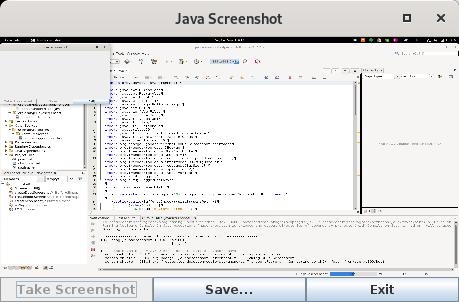

# JavaScreenshot

Creating a screenshot with Java under Wayland.

This uses [dbus-java by hypfvieh](https://github.com/hypfvieh/dbus-java)
to call the [Portal Desktop Screenshot](https://flatpak.github.io/xdg-desktop-portal/portal-docs.html#gdbus-org.freedesktop.portal.Screenshot) (`org.freedesktop.portal.Screenshot`) service.

